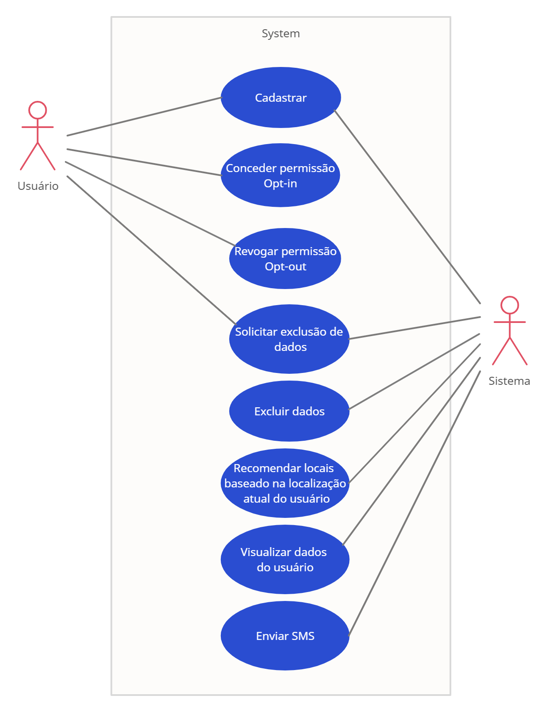
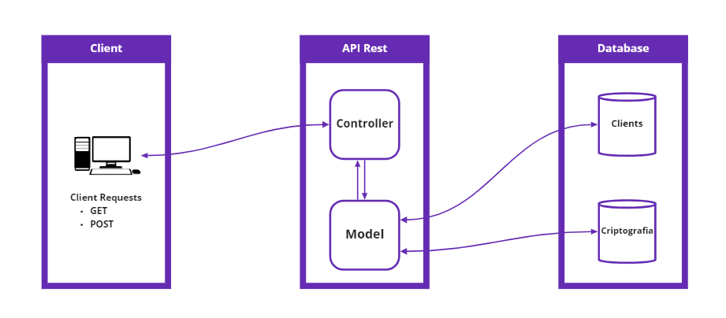

## Introdução
A proposta do projeto é desenvolver uma aplicação utilizando os tópicos da Lei Geral de Proteção de Dados (LGPD).

## Tópicos utilizados

### Opt-in e Opt-out
<br>
Opt-in é a autorização que o cliente dá para receber conteúdo da uma empresa. Simplificando, uma lista de contatos opt-in é um conjunto de pessoas que expressou interesse real em receber algum tipo de conteúdo referente a empresa, sendo realizado diversas vezes por sms ou e-mail. Desta forma, a LGPD deve ser aplicada atentamente com base nos seguintes artigos:
<br>

> Art. 6º, III - necessidade: limitação do tratamento ao mínimo necessário para a realização de suas finalidades, com abrangência dos dados pertinentes, proporcionais e não excessivos em relação às finalidades do tratamento de dados;

<br>

> Art. 6º, VI - transparência: garantia, aos titulares, de informações claras, precisas e facilmente acessíveis sobre a realização do tratamento e os respectivos agentes de tratamento, observados os segredos comercial e industrial;

<br>
Assim, o usuário poderá realizar o descadastramento de sua autorização caso não exista o interesse em receber os conteúdos referente a empresa através do recurso Opt-out. <br>
Através do artigo citado, o sistema conta com o armazenamento de permissões configuradas pelo usuário através de um termo, armazenando também o histórico de modificação de seu concentimento caso haja mudanças juntamente com a versão do termo aceito.

<br>

### Anonimização
<br>
O dado anonimizado, de acordo com artigo 5º, III da Lei Geral de Proteção de Dados, é aquele que não identifica o indivíduo:
<br>

> Art. 5º. III – dado anonimizado: dado relativo a titular que não possa ser identificado, considerando a utilização de meios técnicos razoáveis e disponíveis na ocasião de seu tratamento;

<br>
A anonimização de dados visa, portanto, desatrelar completamente os dados pessoais de seu titular, assegurando sua integridade e identidade, já que as empresas não podem expor essas informações ou usá-las de maneira indevida. <br>
No exemplo praticado no projeto há uma integração que verifica indicações de locais através de da geolocalização do usuário, caso não haja a autorização por parte do usuário através do recurso de Opt-in e Opt-out, o mesmo não receberá as indicações programadas.

<br>

### Exclusão de dados
<br>
O usuário possui total direito de exigir a exclusão de suas informações caso o objetivo do processamento tenha sido concluído ou se não quiser manter mais nenhum tipo de relacionado com o controlador. 
<br>

> Art. 18º, VI - eliminação dos dados pessoais tratados com o consentimento do titular, exceto nas hipóteses previstas no art. 16 desta Lei;

<br>
Nesses casos, vale frisar que a empresa deve excluir definitivamente as informações, não estando autorizada a reter nenhum tipo de dado do usuário. <br>
A implementação com base neste artigo e inciso foi aplicada através da criptografia AES, onde caso o usuário manifeste o interesse de possuir seus dados removidos do sistema, a chave de descriptografia será apagada da base de dados.

<br>

## Estrutura do projeto
### Diagrama de caso de usuário

### Estrutura API

## Documentação API

<details>
<summary>
<b>🟩POST</b> /points
</summary>
Busca locais de indicação com base na geolocalização do usuário e a distância máxima.
<p>Exemplo de parâmetro:</p>

``` json
{
	"user": 1,
	"lat": "-23.23547236880072",
	"long": "-45.87986381107677",
	"maxDistance": "1000"
}
```
</details>

<details>
<summary>
<b>🟩POST</b> /cadastrar
</summary>
Cadastro de clientes com criptografia.
<p>Exemplo de parâmetro:</p>

``` json
{
    "nome": "josias",
    "documento": "2312312",
    "email": "josias@email.com",
    "telefone": "123456798",
    "nascimento": "12/04/2020",
    "cep": "123456",
    "cidade": "Sao Jose",
    "estado": "SP",
    "rua": "rua1",
    "bairro": "Bairro"
}
```
</details>

<details>
<summary>
<b>🟩POST</b> /sendSMS/<\int:id>
</summary>
Verifica permissão e envia o E-mail para o cliente
</details>

<details>
<summary>
<b>🟩POST</b> /alterarPermissao/<\int:id>
</summary>
Altera permissões do usuário
<p>Exemplo de parâmetro:</p>

``` json
{
	"version": "2",
	"itens": {
		"sms": true,
		"email": true,
		"telefone": false,
		"indicacao": true
	}
}
```
</details>

<details>
<summary>
<b>🟩GET</b> /excluir/<\id>
</summary>
Remove o cliente do sistema
</details>

<details>
<summary>
<b>🟩GET</b> /visualizar/<\id>
</summary>
Apresenta um usuário através do id
</details>


## Tecnologias utilizadas
- Python
- ORM PeeWee
- Criptografia AES
- Banco de Dados SQLite

## Integrantes
- Gabriel Queiroz
- Perilo Junior
- Sabrina Calado
